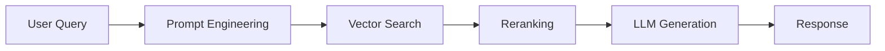

# LangSmith: Complete Observability Guide for AI Applications

[](https://smith.langchain.com/)
[](https://github.com/Shubham8831/LangSmith-Tutorial)
[](LICENSE)

> **A comprehensive guide to implementing observability in AI applications using LangSmith**

## Table of Contents
- [Why LangSmith?](#why-langsmith)
- [Core Concepts](#core-concepts)
- [Getting Started](#getting-started)
- [RAG Implementation Evolution](#rag-implementation-evolution)
- [LangGraph Integration](#langgraph-integration)
- [Advanced Features](#advanced-features)
- [Best Practices](#best-practices)
- [Resources](#resources)

---

## Why LangSmith?

### The AI Debugging Challenge

Large Language Models (LLMs) present unique challenges that traditional debugging tools cannot handle:

**Core Issues:**
- 🎲 **Non-Deterministic Behavior** - Same input produces different outputs
- 🔒 **Black Box Nature** - No visibility into internal decision-making
- 🔇 **Silent Failures** - Quality issues occur without error messages
- 🕸️ **Complex Workflows** - Multi-step pipelines are hard to trace

### Real-World Production Issues

#### 🔍 Case Study 1: AI Job Assistant
**Application:** Automated job matching and cover letter generation
- **Normal Performance:** 1 minute execution time
- **Production Issue:** Sudden spike to 10 minutes
- **Problem:** Cannot identify which component in the complex workflow is causing the slowdown

#### 💰 Case Study 2: Research Assistant Agent
**Application:** Detailed research query processing
- **Normal Cost:** ₹1 per query
- **Production Issue:** Cost jumps to ₹20 per query
- **Problem:** No visibility into token consumption across pipeline components

#### 🤖 Case Study 3: RAG-Based Policy Chatbot
**Application:** Company policy and leave management assistant
- **Production Issue:** Hallucinations providing incorrect information
- **Root Causes:** Either retriever malfunction OR LLM generation issues
- **Problem:** Cannot determine which component is failing

### Why Traditional Debugging Fails

- ❌ No stack traces for quality degradation
- ❌ No error messages for incorrect outputs
- ❌ Cannot inspect LLM reasoning process
- ❌ Difficult to track performance across multi-step workflows

---

## What is Observability?

**Observability** is the ability to understand your system's internal state by examining its external outputs.

### Key Components:
- **📊 Logs** - What happened and when
- **📈 Metrics** - Quantitative measurements
- **🔍 Traces** - Request flow through system components

### AI-Specific Observability Challenges:
| Traditional Apps | AI Applications |
|------------------|-----------------|
| Predictable flows | Dynamic, context-dependent paths |
| Clear error messages | Silent quality degradation |
| Deterministic outputs | Non-deterministic responses |
| Standard monitoring | Custom evaluation metrics needed |

---

## LangSmith: AI Observability Platform

[LangSmith](https://smith.langchain.com/) is a unified platform for debugging, testing, and monitoring AI applications.

### What LangSmith Captures:
- 📥 **Input/Output Data** - Complete request/response pairs
- 🔄 **Intermediate Steps** - Every component execution
- ⏱️ **Performance Metrics** - Latency, token usage, costs
- ❌ **Error Tracking** - Failures and their contexts
- 🏷️ **Custom Metadata** - Tags, versions, user information
- 💬 **User Feedback** - Real-world quality assessments

---

## Core Concepts

### 📁 Project
The complete AI application or workflow
```
Example: Customer Support Bot
```

### 🔗 Trace
A single execution of your entire project
```
User Query: "What is our vacation policy?" = 1 Trace
```

### ⚙️ Run
Individual component executions within a trace
```
Trace: "Vacation policy query"
├── Run 1: Query Processing (Prompt Engineering)
├── Run 2: Document Retrieval (Vector Search)
├── Run 3: Context Ranking (Reranking)
└── Run 4: Answer Generation (LLM)
```

### Visual Representation:


---

## Getting Started

### Prerequisites
- Python 3.8+
- [LangSmith Account](https://smith.langchain.com/) (Free tier available)
- [Groq API Key](https://console.groq.com/keys) (Free tier available)

### Step 1: Repository Setup
```bash
git clone https://github.com/Shubham8831/LangSmith-Tutorial
cd LangSmith-Tutorial
pip install -r requirements.txt
```

### Step 2: Environment Configuration
Create a `.env` file in your project root:

```env
# API Keys
GROQ_API_KEY=your_groq_api_key_here
LANGCHAIN_API_KEY=your_langsmith_api_key_here

# LangSmith Configuration
LANGCHAIN_TRACING_V2=true
LANGCHAIN_ENDPOINT=https://api.smith.langchain.com
LANGCHAIN_PROJECT=your_project_name
```

> 💡 **Get API Keys:**
> - [LangSmith API Key](https://smith.langchain.com/settings)
> - [Groq API Key](https://console.groq.com/keys)

### Step 3: Run First Example
```bash
python 1_simple_llm_call.py
```

### Step 4: View Results
1. Open [LangSmith Dashboard](https://smith.langchain.com/)
2. Navigate to your project
3. Explore traces, metrics, and performance data

---

## Advanced Configuration

### Dynamic Project Naming
```python
import os
os.environ['LANGCHAIN_PROJECT'] = f"Customer-Support-{datetime.now().strftime('%Y-%m')}"
os.environ['LANGCHAIN_PROJECT'] = "your-project-name"
```

### Comprehensive Tracing Configuration(adding run_name, metadata and tags)
```python
from langchain_core.runnables import RunnableConfig

config = RunnableConfig(
    run_name="Policy Query Handler",
    tags=["production", "policy-bot", "v2.1"],
    metadata={
        "user_id": "user_12345",
        "session_id": "session_67890",
        "version": "2.1.0",
        "environment": "production",
        "model_version": "gpt-4-turbo",
        "retrieval_method": "semantic_search"
    }
)

response = chain.invoke(
    {"question": "What is the vacation policy?"},
    config=config
)
```

### Hierarchical Trace Organization(adding run_name, metadata and tags)
```python
# Trace-level configuration
trace_config = {
    "tags": ["high-priority", "policy-query"],
    "metadata": {"urgency": "high", "department": "HR"}
}

# Component-level configuration
llm_config = {
    "run_name": "GPT-4 Policy Generation",
    "tags": ["llm-generation"],
    "metadata": {"temperature": 0.1, "max_tokens": 500}
}
```

---

## RAG Implementation Evolution

> **Tutorial Files:** [GitHub Repository](https://github.com/Shubham8831/LangSmith-Tutorial)

### Version 1: Basic RAG (`3_rag_v1.py`)
**Issues Identified:**
- ❌ Only LangChain runnables traced
- ❌ Document loading invisible
- ❌ Text chunking not monitored
- ❌ Vector store recreation on each run
- ❌ Incomplete pipeline visibility

**Observation:** Limited debugging capability for RAG components

### Version 2: Adding Observability (`3_rag_v2.py`)
**Solution:** `@traceable` decorator implementation above individual functions(can also add name, tag and metadata)

```python
from langsmith import traceable

@traceable(
    name="Document Loader",
    tags=["preprocessing", "io"],
    metadata={"loader_type": "pdf", "chunk_size": 1000}
)
def load_documents(file_path: str):
    """Load and process documents with full tracing"""
    # Document loading implementation
    return documents

@traceable(name="Text Chunking", tags=["preprocessing"])
def chunk_documents(documents):
    """Split documents into chunks with tracing"""
    # Chunking implementation
    return chunks

@traceable(name="Vector Store Creation", tags=["embedding"])
def create_vector_store(chunks):
    """Create vector database with tracing"""
    # Vector store implementation
    return vector_store
```

**New Issue:** Components traced individually, lacking pipeline 

### Version 3: Pipeline Integration (`3_rag_v3.py`)
**Solution:** Unified pipeline with hierarchical tracing
- ✅ All components traced with proper relationships
- ✅ Unified pipeline visualization
- ✅ Organized metadata and tagging
- ❌ Performance inefficiency remains

**Achievement:** Complete pipeline observability

### Version 4: Production-Ready (`3_rag_v4.py`)
**Solution:** Optimized persistent vector store + comprehensive tracing
- ✅ Vector store created once, reused efficiently
- ✅ Complete component tracing
- ✅ Production-grade performance
- ✅ Comprehensive error handling

### Evolution Comparison
| Feature | v1 | v2 | v3 | v4 |
|---------|----|----|----|----|
| Chain Tracing | ✅ | ✅ | ✅ | ✅ |
| Function Tracing | ❌ | ✅ | ✅ | ✅ |
| Pipeline Unity | ❌ | ❌ | ✅ | ✅ |
| Performance Optimized | ❌ | ❌ | ❌ | ✅ |
| Production Ready | ❌ | ❌ | ❌ | ✅ |

---

## LangGraph Integration

> **Example File:** `5_langgraph.py`

### Complex Workflow Challenges
**Problem:** LangGraph creates complex, branching workflows that are difficult to debug and monitor.

### LangSmith Solution:
- **Graph Execution** → Complete trace with all nodes
- **Each Node** → Individual run (retriever, LLM, tools, sub-graphs)
- **Path Visualization** → Clear execution flow mapping
- **Branch Tracking** → Conditional and parallel path monitoring

### Example Workflow:
```
START → Query Analysis → Document Retrieval → Relevance Check
                                          ↓
    Response Generation ← Context Ranking ← [Relevant?]
                                          ↓
                              Fallback Response ← [Not Relevant?]
```

**Benefits:**
- 🔍 Complete visibility into graph execution
- 📊 Performance metrics for each node
- 🐛 Easy identification of bottlenecks
- 🔀 Understanding of decision paths

---

## Advanced Features

### 👥 User Feedback Integration
**Implementation:**
```python
from langsmith import Client

client = Client()

# Capture user feedback
client.create_feedback(
    run_id=run_id,
    key="user_rating",
    score=0.8,
    comment="Accurate and helpful response"
)
```

**Capabilities:**
- Real-time feedback collection
- Feedback-trace correlation
- Bulk analysis and insights
- Quality improvement loops

### 🤝 Team Collaboration
**Features:**
- Cross-functional dashboard access
- Trace annotation and commenting
- Shared experiment tracking
- Role-based permissions

**Use Cases:**
- Product managers reviewing AI quality
- QA teams annotating edge cases
- Engineers debugging issues collaboratively

### 📊 Dataset Management
**Workflow:**
```python
from langsmith import Client

client = Client()

# Create evaluation dataset
dataset = client.create_dataset(
    dataset_name="Customer_Support_Eval",
    description="Evaluation dataset for policy questions"
)

# Add examples
client.create_example(
    dataset_id=dataset.id,
    inputs={"question": "What is the vacation policy?"},
    outputs={"answer": "Employees get 20 days annual leave..."}
)
```

**Applications:**
- Model evaluation benchmarks
- Fine-tuning data preparation
- A/B testing frameworks
- Performance regression testing

### 🧪 Prompt Experimentation
**A/B Testing Framework:**
```python
def run_prompt_experiment():
    prompts = {
        "formal": "Please provide a professional response...",
        "casual": "Hey! Can you help me understand...",
        "detailed": "Provide a comprehensive explanation..."
    }
    
    for prompt_type, prompt_text in prompts.items():
        config = {"tags": [f"experiment_{prompt_type}"]}
        # Run evaluation with each prompt
```

### 📈 Evaluation System
**Comprehensive Quality Metrics:**

```python
from langsmith.evaluation import LangChainStringEvaluator

# Faithfulness evaluation
faithfulness_evaluator = LangChainStringEvaluator("faithfulness")

# Relevance evaluation
relevance_evaluator = LangChainStringEvaluator("relevance")

# Custom evaluation
def custom_policy_evaluator(run, example):
    """Custom evaluator for policy-specific responses"""
    # Implementation
    return {"score": score, "reasoning": explanation}
```

**Evaluation Types:**
- **Offline:** Pre-deployment batch testing
- **Online:** Continuous production monitoring
- **Custom:** Domain-specific quality metrics

### 🚨 Production Monitoring
**Alert Configuration:**
```python
# Monitor key metrics
metrics_to_track = {
    "latency_p95": {"threshold": 2000, "unit": "ms"},
    "cost_per_query": {"threshold": 0.50, "unit": "USD"},
    "error_rate": {"threshold": 0.05, "unit": "percentage"},
    "user_satisfaction": {"threshold": 0.8, "unit": "score"}
}
```

**Monitoring Capabilities:**
- Real-time performance dashboards
- Automated alert systems
- Cost tracking and optimization
- Quality degradation detection

---

## Best Practices

### 🏗️ Project Organization
```python
# Use descriptive project names
os.environ['LANGCHAIN_PROJECT'] = f"PolicyBot-{environment}-v{version}"

# Implement consistent tagging
tags = [
    f"env-{environment}",
    f"version-{app_version}",
    f"model-{model_name}",
    "production" if is_production else "development"
]
```

### 🔍 Effective Tracing
```python
@traceable(
    name="Document Retrieval",
    tags=["rag", "retrieval"],
    metadata={
        "retrieval_method": "semantic_search",
        "top_k": 5,
        "similarity_threshold": 0.8
    }
)
def retrieve_documents(query: str):
    # Clear, descriptive function names
    # Comprehensive metadata
    # Appropriate tagging
    pass
```

### 📊 Evaluation Strategy
1. **Define Clear Metrics:** Establish what "good" looks like
2. **Create Diverse Datasets:** Cover edge cases and typical usage
3. **Automate Evaluations:** Integrate into CI/CD pipeline
4. **Monitor Continuously:** Track performance over time
5. **Act on Insights:** Use data to drive improvements

### 🔐 Security Considerations
- Sanitize sensitive data in traces
- Use appropriate access controls
- Implement data retention policies
- Regular security audits

---

## Troubleshooting

### Common Issues:

**🔴 Traces Not Appearing**
```python
# Verify environment variables
import os
print(f"LANGCHAIN_TRACING_V2: {os.getenv('LANGCHAIN_TRACING_V2')}")
print(f"LANGCHAIN_API_KEY: {'Set' if os.getenv('LANGCHAIN_API_KEY') else 'Not Set'}")
```

**🔴 High Costs**
- Monitor token usage patterns
- Implement caching strategies
- Optimize prompt efficiency
- Use appropriate model tiers

**🔴 Performance Issues**
- Check network latency
- Optimize retrieval components
- Implement async operations
- Monitor resource utilization

---

## Resources

### 📚 Documentation
- [LangSmith Official Docs](https://docs.smith.langchain.com/)
- [LangChain Documentation](https://python.langchain.com/)
- [Best Practices Guide](https://docs.smith.langchain.com/evaluation/best_practices)

### 🎯 Learning Path
1. **Beginner:** Start with `1_simple_llm_call.py`
2. **Intermediate:** Progress through RAG implementations (v1-v4)
3. **Advanced:** Explore LangGraph integration and evaluation
4. **Expert:** Implement custom evaluators and monitoring

### 🛠️ Tools & Integrations
- [LangSmith SDK](https://pypi.org/project/langsmith/)
- [LangChain Hub](https://smith.langchain.com/hub)
- [Community Examples](https://github.com/langchain-ai/langsmith-cookbook)

### 🤝 Community
- [LangChain Discord](https://discord.gg/langchain)
- [GitHub Discussions](https://github.com/langchain-ai/langchain/discussions)
- [Stack Overflow](https://stackoverflow.com/questions/tagged/langchain)

---

## Conclusion

LangSmith transforms AI development from experimental guesswork to systematic, data-driven engineering:

### Key Benefits:
- 🔍 **Complete Visibility** - See every step of your AI workflow
- 📊 **Data-Driven Decisions** - Optimize based on real performance data
- 🚀 **Faster Debugging** - Quickly identify and resolve issues
- 👥 **Team Collaboration** - Enable cross-functional AI development
- 📈 **Continuous Improvement** - Build feedback loops for quality enhancement

### Your Learning Journey:
1. 🚀 **Start Here:** Clone the [tutorial repository](https://github.com/Shubham8831/LangSmith-Tutorial)
2. 🔧 **Setup:** Configure your environment following this guide
3. 🎯 **Practice:** Run examples from simple LLM to complex RAG
4. 📊 **Explore:** Use LangSmith dashboard for insights
5. 🏗️ **Build:** Apply these concepts to your AI projects
6. 📈 **Scale:** Implement production monitoring and evaluation

### Final Thoughts
In the era of non-deterministic AI, observability isn't just helpful—it's essential for building reliable, scalable applications that users can trust.

**Ready to build better AI?** Start your journey with LangSmith today! 🚀

---

<div align="center">

**Happy Building! 🎯**

[](https://github.com/Shubham8831/LangSmith-Tutorial)
[](https://smith.langchain.com/)

</div>